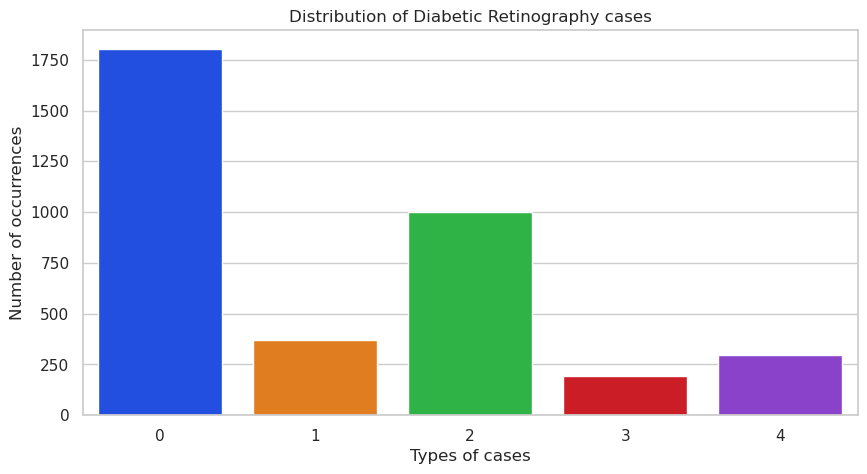
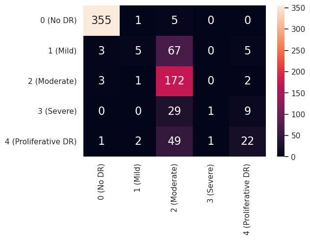

# AI-diabetes-retinopathy
This repository contains an AI model for detecting Diabetes Retinopathy through medical images. Diabetes Retinopathy is a serious eye complication that can lead to blindness, particularly in individuals with type 1 or type 2 diabetes. The goal of this project is to enhance the efficiency and accuracy of Diabetes Retinopathy detection using computer vision techniques.

# Data visualisation
The dataset of retina images is obtained from Kaggle (https://www.kaggle.com/competitions/aptos2019-blindness-detection). The chart below illustrates the class distribution of the images in this dataset.

# Image processing
To make the images clearer and allow the model to learn image features more effectively, image processing techniques were deployed using OpenCV. 
1. Gaussian Blur: This technique enhances distinctive features in the images, making them more recognizable for the model.
2. Circular Cropping: It removes irrelevant elements from the images, reducing distractions and focusing the model on the relevant areas.
3. Image Augmentation: By utilizing the Keras ImageDataGenerator class, additional images were generated from the dataset. Augmentation introduces variations in the training data, enhancing the model's ability to handle changes in lighting, viewpoints, and other factors.

# Deep Learning Model Training

For the task of Diabetes Retinopathy detection, a Transfer Learning approach was employed, building upon the widely-used ResNet50 architecture. Transfer Learning allows us to leverage the pre-trained weights and knowledge from ResNet50, which was originally trained on a large-scale dataset for general image classification tasks. By reusing these learned features, we can expedite the training process and potentially achieve better performance on our specific task.

To adapt ResNet50 for Diabetes Retinopathy detection, the following steps were taken:

1. Model Initialization: The ResNet50 model with pre-trained weights was loaded, excluding the top (classification) layer. This allowed us to preserve the learned feature extraction capabilities while replacing the final classification layer to suit our specific problem.

2. Additional Layers: A few additional layers were added on top of the ResNet50 base. Global Average Pooling layer was included to reduce the spatial dimensions of the features while retaining the most relevant information. Dropout layer was introduced to prevent overfitting and improve the model's generalization ability. The Dropout layer randomly sets a fraction of input units to 0 during training, which helps to avoid over-reliance on specific features. Dense layers were also added to enhance the model's learning given the complex patterns and relationships in image-related data. 

3. Training: The model was trained on the preprocessed image dataset using backpropagation and gradient descent optimization. During training, the model learns to adjust its internal parameters to minimize the difference between predicted and actual labels. This process involves passing the training data through the network, calculating the loss (error) between predictions and true labels, and updating the model's weights through backpropagation.

4. Optimization: To optimize the model's performance, a suitable loss function and optimizer were selected. For image classification tasks, categorical cross-entropy loss is commonly used. It measures the dissimilarity between predicted probabilities and true labels. Additionally, the Adam optimizer was chosen due to its adaptive learning rate and momentum.

5. Hyperparameter Tuning: Various hyperparameters, such as learning rate, batch size, and number of epochs, were tuned to find the optimal configuration. This iterative process involved training the model with different parameter values, evaluating its performance, and selecting the best set of hyperparameters that yielded the highest accuracy on the validation set.

# Evaluation
In the end, an accuracy of approximately 75% was achieved on the test set of results while an accuracy of 95% was achieved on the training data. 
The following shows the confusion matrix on the results for the test dataset. 

# Future Work
1. There is likely to be overfitting in the model given that the accuracy for the test dataset is noticeably lower than that of the training dataset. Hence, the model could benefit from the usage of Ensembling across various architectures to improve on its generalisation ability. 

2. Create a web UI for users to send in the medical image that they want to test on, improving the ease of use.
